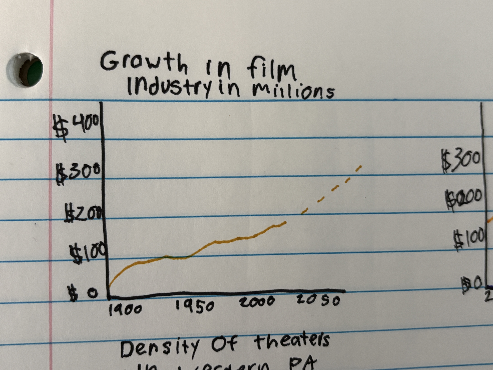
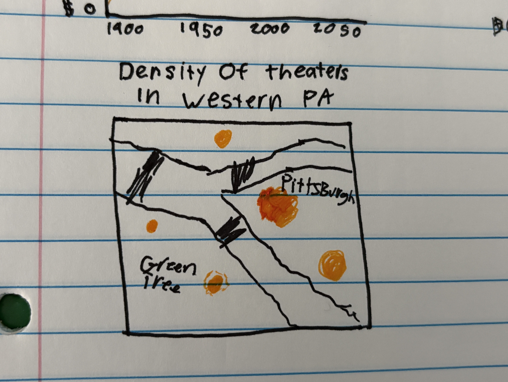
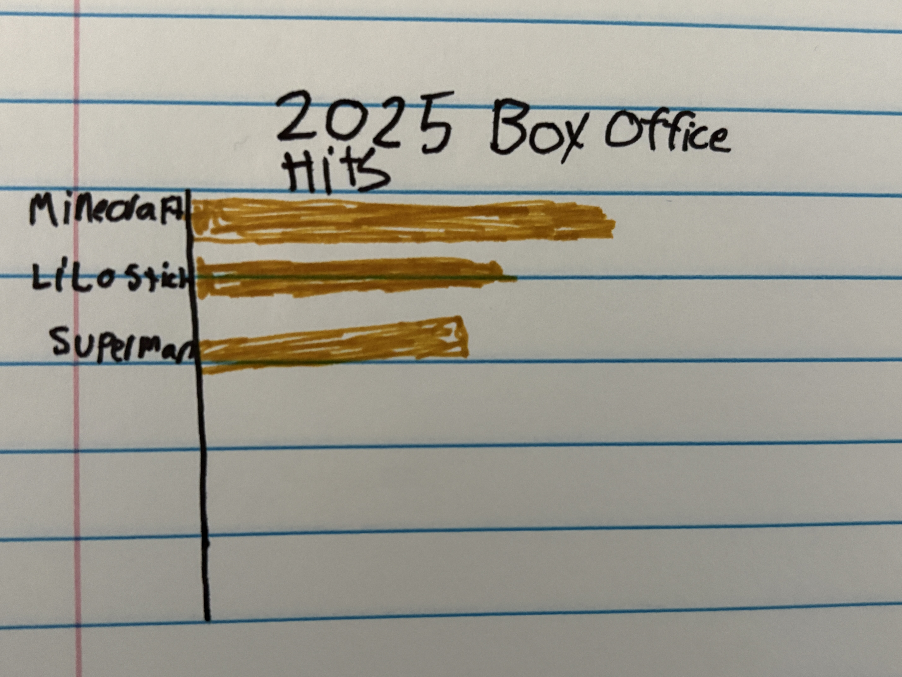
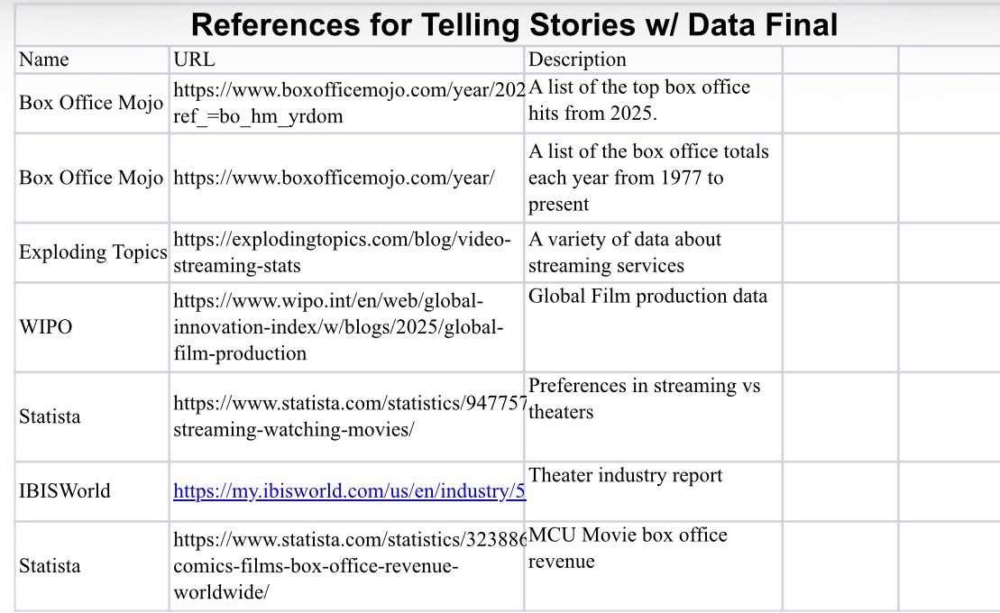

| [home page](https://cmustudent.github.io/tswd-portfolio-templates/) | [data viz examples](dataviz-examples) | [critique by design](critique-by-design) | [final project I](final-project-part-one) | [final project II](final-project-part-two) | [final project III](final-project-part-three) |

# Outline
For my final project, I want to create a breakdown of the creation of the film industry and the growth of movie theaters over the years. I want to illustrate the importance of movie theaters as an experience and the benefits of seeing a film in theaters versus just streaming them at home. The final aspect will be what creates a good theater experience, to encourage theaters to make adjustments to bring more foot traffic into movie theaters. I want to make my target audience for the presentation the theater executives to encourage them to make meaningful change that helps support the continued growth of theaters.

Structurally, I want to break my project into 3 sections. The first one is a summary of the film industry from its creation to now, showcasing important elements like when theaters were created and the first film to break $1 billion at the box office. Secondly, I want to show the changes in the industry, such as the introduction of streaming platforms and COVID-19s impact on theaters. For the final aspect, I want to focus on events that brought many people out to theaters. Some of these examples include "Avengers: Endgame (2019)" and "Barbie (2023). Both of these were major theatrical events that generated over one billion dollars at the box office. So they are great examples of times theaters excelled at getting more viewers to come see a film.

By combining these elements, the project will demonstrate the growth and fall of the film industry and encourage theaters to make changes that help bring them back to their peak.

## Initial sketches

# The data
During the first round of my research, I identified several sources that contain varying data about the top films, production of films, as well as some data about streaming services. I will use this data to compare the value of the streaming industry versus theaters. I also gathered some revenue data about "Avengers: Endgame (2019)" that will help develop the story of an event that boosted foot traffic to movie theaters. On top of these  sources, I will extend my research further to find more data that helps illustrate the growth of theaters.

# Method and medium
To create my project, I have broken it down into a series of steps to streamline the process and ensure my timing stays on track. For the first step, I am narrowing down my story to determine exactly what I want to say. I am then going to create a wireframe outline of my project with a few sketches of the data visualizations I would like to create to support my material. 

For the second step, I am going to research my topic further than I already have and find sources to develop my story around. In my research, I will focus on finding sources that contain the data needed for my visualizations as well. Then, once I have my specific data, I will start to build my story around it so I can tell a story about the development of movie theaters that is truthful to its data. 

Once I have my data, I am going to utilize Tableau to build each of these graphs. I did some sketches of graphs with specific data I would like to utilize, though I may adjust the style depending on what data and information I find in my research. Utilizing these graphs, I will build a short presentation in Shorthand to show off my story as well as my data. 

## References
Good Charts by Scott Berinato

## AI acknowledgements
Grammarly was used to help edit spelling and grammar.
