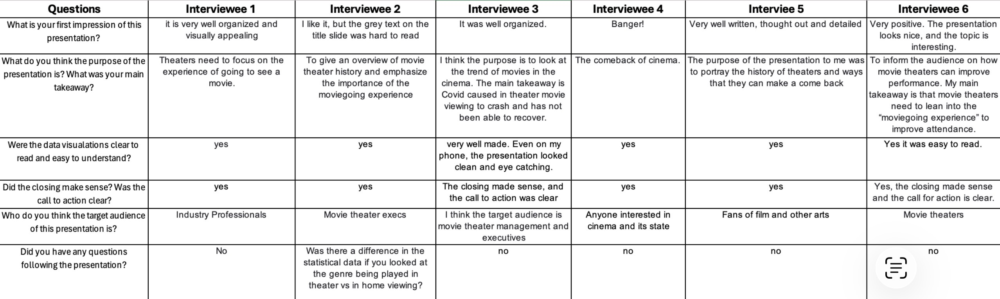

| [home page](https://bethanyed.github.io/Bethanys-Data-Portfolio/) | [critique by design](critique-by-design.md) | [final project I](final-project-part-one.md) | [final project II](final-project-part-two.md) | [final project III](final-project-part-three.md) | [visualizing government dept](visualizing-government-debt.md)

# The final data story
[Shorthand link](https://preview.shorthand.com/3IzhBFQBxAum5Shf)

# Changes made since Part II
Since part 2, I have expanded my wireframe into a presentation that is more fleshed out. I added text to each section that supports the details of the header. The first two data visualizations I had created were modified to fit the specific color scheme that matches my mood board, which is red and gold. On top of that, I created two more data visualizations. The first one is a line graph that compares the Marvel Cinematic Universe box office earnings. I liked the data for this one specifically because it shows the massive spike for Avengers: Endgame, which helped support my claims in the paragraph. Next to that, I created a graph with different sized squares to indicate the difference between viewership in theaters and at home. Each block indicates a different medium, but the two colors indicate which ones are in the theater and which ones are from home. The visual aspects were fine-tuned to fit the moodboard through color and visuals. 

## The audience
My target audience for this presentation is theater stakeholders and decision-makers. I fleshed out my call to action to be targeted at people who are in charge of theaters so they can make modifications that bring back consumers to theaters. I chose to go this way because I want to show the importance of theaters as a moviegoing experience by helping rejuvenate and modernize them to fit what people look for in experiences these days.

## Additional Research

## Final design decisions
For my final designs, I decided it was most effective and clear to stick to the basic style graphs of bar and line. They were most effective at sharing the data I needed and made the points I needed to make. The only visualization I included that was different is a chart that has different sized blocks to represent each category. I decided that for my overall presentation design, I wanted them all to be color coordinated, following the color scheme associated with the golden age of Hollywood. I focused on reds for the charts and gold for the presentation. 

## References
All references were listed in Shorthand.

## AI acknowledgements
Grammarly was utilized to edit grammar and spelling. Google Gemini was used to organize data from articles into Excel spreadsheets.

# Final thoughts
For this project, I wish I was able to dedicate more time to fleshing out the presentation and incorporating more interesting details to support my data. I really enjoyed the process as this is a topic I am very passionate about, however, I wasn't able to even scratch the surface of the content I wanted to for this assignment. 

