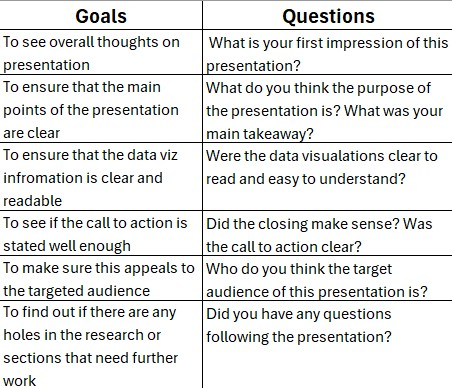

| [home page](https://cmustudent.github.io/tswd-portfolio-templates/) | [data viz examples](dataviz-examples) | [critique by design](critique-by-design) | [final project I](final-project-part-one) | [final project II](final-project-part-two) | [final project III](final-project-part-three) |

# Wireframe
[Link to Shorthand Presentation](https://preview.shorthand.com/3IzhBFQBxAum5Shf)

# User research 

## Target audience
For my target audience, I determined that I want to target theater executives and other stakeholders for movie theaters. Since my presentation and research focuses on movie theaters, the growth of streaming, and major events that lead to significant success in theater chains, I thought it made the most sense to target those in control of those chains. My call to action will be ways that they can improve their theaters to regain customers. So, to me it made the most sense to focus my target demographic on the decision makers for movie theaters.

## Interview script
For my interview, my goal is to ask people of varying demographics to review the Shorthand presentation and answer a short survey regarding its contents. I want to analyze the readability, effectiveness of graphs, as well as the overall effectiveness of the presentation. 

## Interview findings
> Detail the findings from your interviews.  Do not include PII.  Capture specific insights where possible.

Text here!

| Questions               | Interview 1 (briefly describe) | Interview 2 | Interview 3 |
|-------------------------|--------------------------------|-------------|-------------|
| Question you asked here | Insightful feedback            |             |             |
|                         |                                |             |             |
|                         |                                |             |             |

# Identified changes for Part III
> Document the changes you plan on implementing next week to address any issues identified.  

Text here!

| Research synthesis                       | Anticipated changes for Part III                                                |
|------------------------------------------|---------------------------------------------------------------------------------|
| Findings or observations from interviews | Describe what, if any changes you anticipate making to address the observation. |
|                                          |                                                                                 |
|                                          |                                                                                 |
|                                          |                                                                                 |
| ...add more rows as necessary            |                                                                                 |

> ...include any final thoughts you have here. 

Text here!

# Moodboards / personas

## References

## AI acknowledgements
No AI was used for this assignment.
